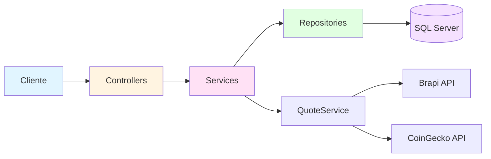
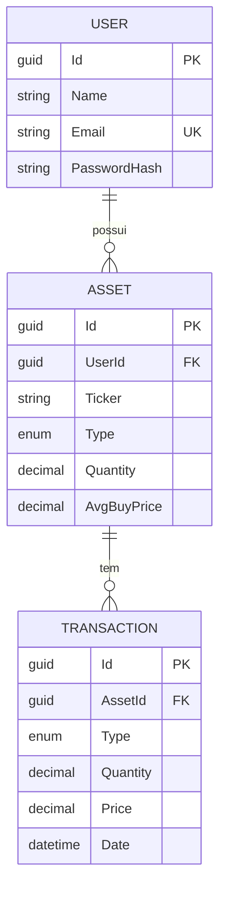
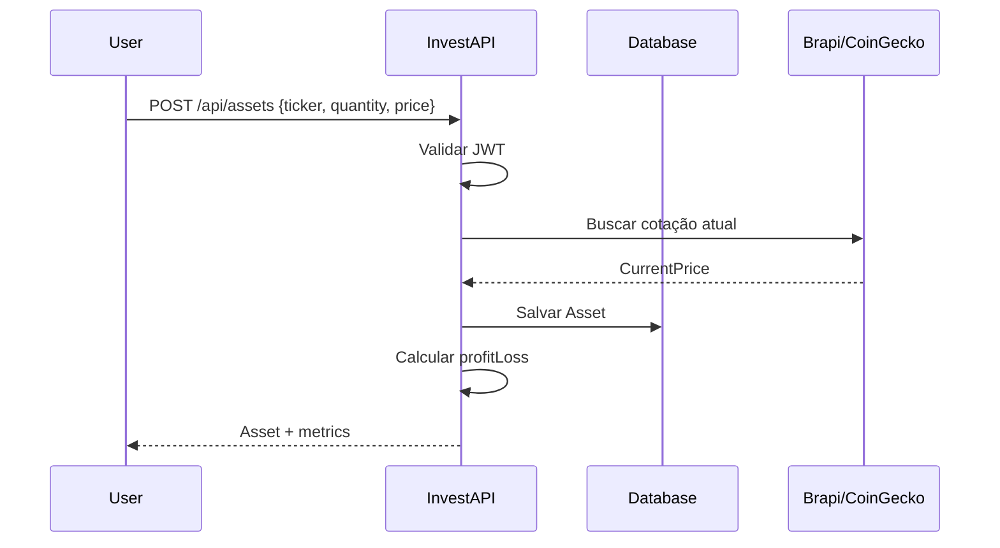

# 📊 InvestAPI

<div align="center">


**API REST para gerenciamento inteligente de carteira de investimentos**

[Features](#-features) • [Arquitetura](#-arquitetura) • [Como Usar](#-como-usar) • [Endpoints](#-endpoints)

</div>

---

## 🎯 Sobre o Projeto

API completa para controle de investimentos em **ações brasileiras (B3)** e **criptomoedas**, com cotações em tempo real via integração com APIs externas (Brapi e CoinGecko).

### ✨ Features

- 🔐 Autenticação JWT com hash BCrypt
- 💼 Gerenciamento completo de ativos (CRUD)
- 💸 Sistema de transações (compra/venda)
- 📊 Portfolio com métricas de performance
- 📈 Dashboard com diversificação e rentabilidade
- ⚡ Cache inteligente de cotações (5 min)
- 🔄 Cálculo automático de preço médio

---

## 🛠️ Stack

| Tecnologia            | Uso            |
| --------------------- | -------------- |
| .NET 10               | Framework      |
| Entity Framework Core | ORM            |
| SQL Server            | Banco de dados |
| JWT Bearer            | Autenticação   |
| FluentValidation      | Validações     |
| Swagger/OpenAPI       | Documentação   |

**APIs Externas:**

- [Brapi](https://brapi.dev) - Ações B3
- [CoinGecko](https://www.coingecko.com) - Criptomoedas

---

## 📐 Arquitetura



**Camadas:**

- **Controllers** → Validação JWT e roteamento
- **Services** → Regras de negócio
- **Repositories** → Acesso a dados (EF Core)
- **QuoteService** → Integração com APIs externas

---

## 🗄️ Modelo de Dados



---

## 🚀 Como Usar

### Pré-requisitos

- .NET 10 SDK
- SQL Server (ou SQL Server LocalDB)
- Conta Railway (para deploy)

### Instalação Local

```bash
# Clone o repositório
git clone https://github.com/seu-usuario/InvestAPI.git
cd InvestAPI

# Configure a connection string
# Edite appsettings.json com suas credenciais SQL Server

# Rode as migrations
dotnet ef database update

# Execute o projeto
dotnet run
```

A API estará disponível em `https://localhost:7000` com Swagger em `/swagger`

### Variáveis de Ambiente

```bash
ConnectionStrings__DefaultConnection="Server=(localdb)\\mssqllocaldb;Database=InvestAPIDb;Trusted_Connection=true;TrustServerCertificate=true;"
JwtSettings__SecretKey="sua-chave-secreta-com-32-caracteres-minimo"
JwtSettings__Issuer="InvestAPI"
JwtSettings__Audience="InvestAPI-Users"
JwtSettings__ExpirationInDays="7"
```

### Status atual de migrations

- Migration inicial criada: `InitialCreate`
- Provider atual das migrations: SQL Server
- Comando para aplicar no banco local:

```bash
dotnet ef database update
```

---

## 📡 Endpoints

### Autenticação

| Método | Rota                 | Descrição               |
| ------ | -------------------- | ----------------------- |
| POST   | `/api/auth/register` | Registra novo usuário   |
| POST   | `/api/auth/login`    | Autentica e retorna JWT |

### Assets 🔒

| Método | Rota               | Descrição            |
| ------ | ------------------ | -------------------- |
| POST   | `/api/assets`      | Adiciona ativo       |
| GET    | `/api/assets`      | Lista ativos         |
| GET    | `/api/assets/{id}` | Detalhes + histórico |
| DELETE | `/api/assets/{id}` | Remove ativo         |

### Transactions 🔒

| Método | Rota                | Descrição             |
| ------ | ------------------- | --------------------- |
| POST   | `/api/transactions` | Registra compra/venda |
| GET    | `/api/transactions` | Lista transações      |

### Portfolio 🔒

| Método | Rota                         | Descrição             |
| ------ | ---------------------------- | --------------------- |
| GET    | `/api/portfolio/summary`     | Resumo da carteira    |
| GET    | `/api/portfolio/performance` | Performance por ativo |
| GET    | `/api/dashboard`             | Dashboard completo    |

🔒 = Requer autenticação (Bearer token)

---

## 💡 Exemplo de Uso

### 1. Registrar usuário

```bash
POST /api/auth/register
Content-Type: application/json

{
  "name": "João Silva",
  "email": "joao@example.com",
  "password": "SenhaForte123!",
  "confirmPassword": "SenhaForte123!"
}
```

### 2. Fazer login

```bash
POST /api/auth/login
Content-Type: application/json

{
  "email": "joao@example.com",
  "password": "SenhaForte123!"
}
```

**Response:**

```json
{
  "token": "eyJhbGciOiJIUzI1NiIsInR5cCI6IkpXVCJ9...",
  "email": "joao@example.com",
  "name": "João Silva"
}
```

### 3. Adicionar ativo

```bash
POST /api/assets
Authorization: Bearer {seu-token}
Content-Type: application/json

{
  "ticker": "PETR4",
  "type": "Stock",
  "quantity": 100,
  "avgBuyPrice": 38.50
}
```

**Response:**

```json
{
  "id": "3fa85f64-5717-4562-b3fc-2c963f66afa6",
  "ticker": "PETR4",
  "currentPrice": 40.2,
  "totalInvested": 3850.0,
  "currentValue": 4020.0,
  "profitLoss": 170.0,
  "profitLossPercentage": 4.42
}
```

---

## 🔄 Fluxo de Transação



---

## 🧮 Lógica de Negócio

### Cálculo de Preço Médio

```
Novo Avg = (Qty Atual × Avg Atual) + (Qty Nova × Preço Novo)
           ───────────────────────────────────────────────────
                        Qty Atual + Qty Nova
```

**Exemplo:**

- Tinha: 50 ações @ R$ 37,00 = R$ 1.850
- Comprou: 50 ações @ R$ 40,00 = R$ 2.000
- **Novo avg:** R$ 38,50

### Cálculo de Rentabilidade

```
Lucro/Prejuízo = (Qty × Preço Atual) - (Qty × Preço Médio)
Percentual = (Lucro / Valor Investido) × 100
```

---

## 📦 Deploy

### Railway

```bash
# Instale o Railway CLI
npm install -g @railway/cli

# Login
railway login

# Deploy
railway up
```

A API será deployada automaticamente com PostgreSQL incluso no free tier.

---

## 🧪 Testes

```bash
# Rodar testes unitários (quando implementados)
dotnet test
```

---

## 📚 Documentação Adicional

- **Swagger:** Acesse `/swagger` quando a API estiver rodando
- **Postman Collection:** [Link para collection] (adicionar depois)

---

## 🤝 Contribuindo

Contribuições são bem-vindas! Sinta-se livre para abrir issues e pull requests.

1. Fork o projeto
2. Crie uma branch (`git checkout -b feature/MinhaFeature`)
3. Commit suas mudanças (`git commit -m 'Add: nova feature'`)
4. Push para a branch (`git push origin feature/MinhaFeature`)
5. Abra um Pull Request

---

## 📄 Licença

Este projeto está sob a licença MIT. Veja o arquivo [LICENSE](LICENSE) para mais detalhes.

---

## 👨‍💻 Autor

**Seu Nome**

[](https://linkedin.com/in/seu-perfil)
[](https://github.com/seu-usuario)

---

<div align="center">

**⭐ Se este projeto te ajudou, considere dar uma estrela!**

Made with ❤️ and C#

</div>
